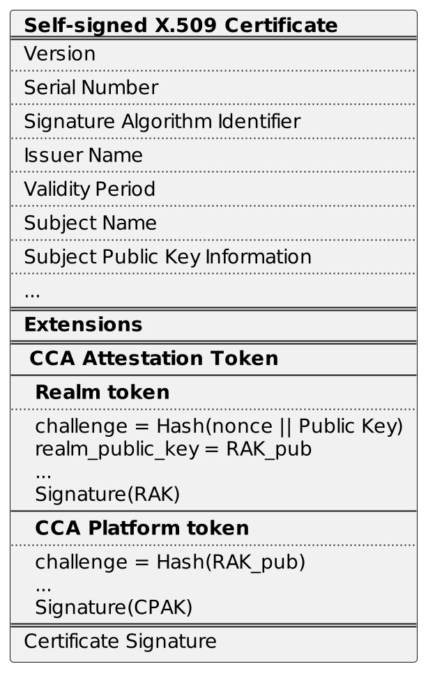
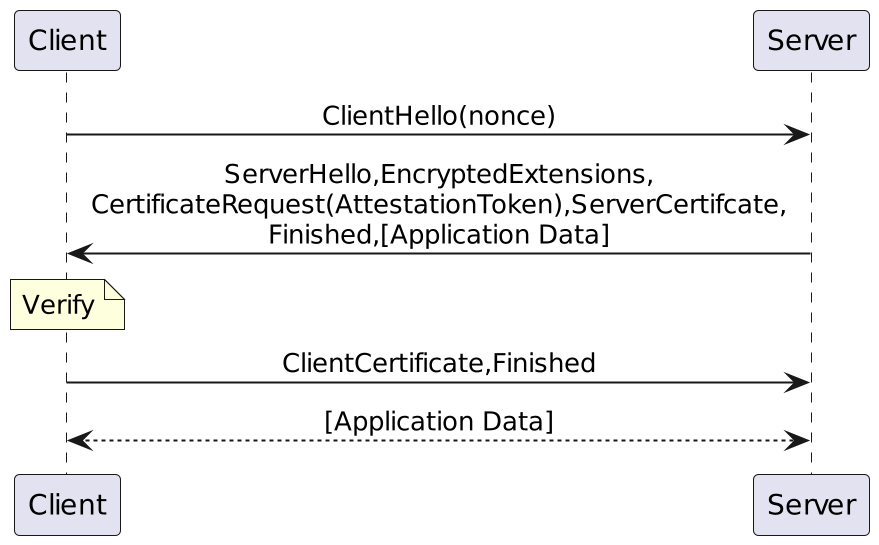
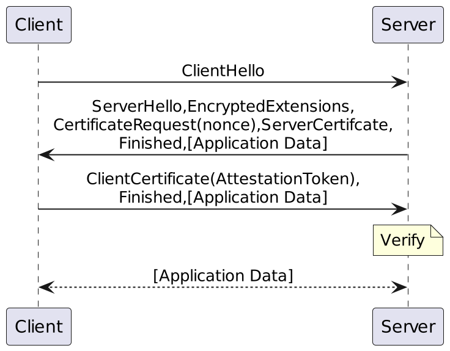
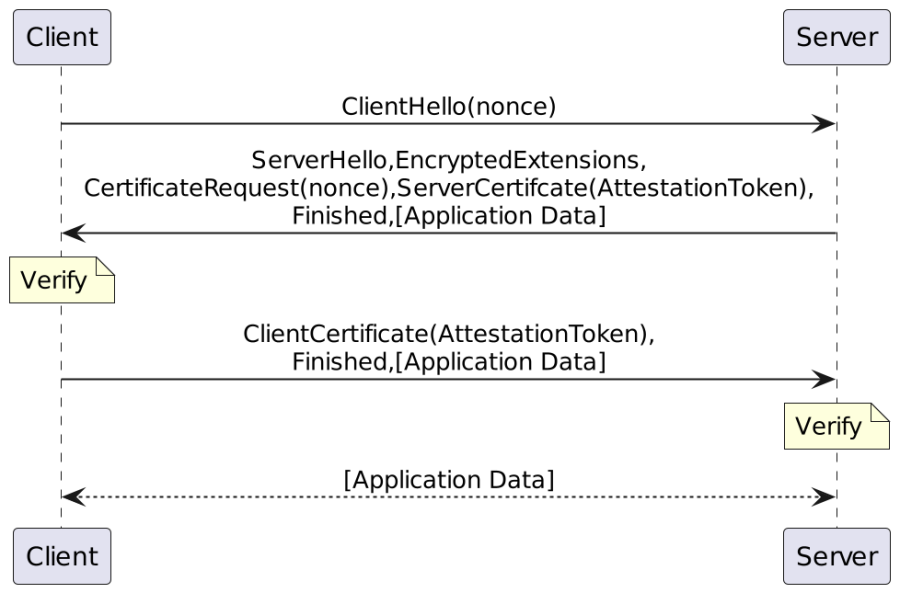

# RA-TLS for ARM CCA

To establish a secure connection between the Realm and the Reliant Party, a protocol that combines Remote Attestation with Transport Security Layer (TLS) needs to be used. This project uses a similar approach to the SGX Attested TLS implementation. Such solution has several advantages compared to crafting a custom cryptographic protocol:
* The TLS protocol is mature and is well-supported by all popular cryptographic libraries (OpenSSL, mbedtls, etc.).
* As TLS is widely used, it will most likely be adjusted to support Post Quantum Computing cipher suites. This will ease the future transition to Post Quantum TLS.
* The technique doesn't require changes in the TLS libraries, so the application developers can use the libraries in the same way as usual.
* The inability to establish a secure connection means that the remote attestation has failed. No additional handling of errors is needed.
* It protects from the masquerading attacks.

This technique is leveraged by many Confidential Computing projects, such as:
* [Edgelesssys Constellation aTLS](https://github.com/edgelesssys/constellation/tree/main/internal/atls)
* [SGX Attested TLS](https://github.com/intel/linux-sgx/tree/master/SampleCode/SampleAttestedTLS)
* [OpenEnclave Attested TLS](https://github.com/openenclave/openenclave/blob/master/samples/attested_tls/AttestedTLSREADME.md)
* [Gramine RA-TLS](https://github.com/gramineproject/gramine/tree/master/tools/sgx/ra-tls)
* [Inclave Containers RATS-TLS](https://github.com/inclavare-containers/rats-tls/blob/master/docs/design/design.md)

There is also an effort to standardize and unify this approach over the existing Confidential Computing (CC) technologies:
* [Using Attestation in Transport Layer Security (TLS) and Datagram Transport Layer Security (DTLS) IETF draft](https://datatracker.ietf.org/doc/draft-fossati-tls-attestation/), the reference implementation based on Mbed TLS can be found here [tls-attestation](https://github.com/hannestschofenig/mbedtls/tree/tls-attestation)
* [Confidential Computing Consortium Interoperable TLS](https://github.com/CCC-Attestation/interoperable-ra-tls), [Unifying Remote Attestation Protocol Implementations (blogpost)](https://confidentialcomputing.io/2023/03/06/unifying-remote-attestation-protocol-implementations/)

## RA-TLS details

The RA-TLS implementation is based on the ideas used in SGX Attested TLS and Edgelesssys Constellation aTLS projects. The RA-TLS library contained in this repository utilizes the TLS layer from the RusTLS library and performs remote attestation by providing custom certificate resolvers and verifiers. During the startup, a Realm application generates an asymmetric key pair (a private key and a corresponding public key). The keys will be used to generate a self-signed certificate. During the TLS handshake, a Verifier (or a Reliant Party) sends a request containing the randomly generated nonce. The Realm application calculates a challenge as a hash of the nonce (received from the requester) and the public key (challenge = Hash(nonce || Public Key)). Then, the application requests the CCA attestation token by providing challenge. The resulting attestation token is embedded into the self-signed certificate. Next, the certificate is sent to the requester. The requester verifies the self-signed certificate, checks the cryptographic binding between the attestation token and the certificate and verifies the content of the token. The negative appraisal of the CCA attestation token causes a disconnection.

#### X.509 certificate with the embedded CCA attestation token

### Use cases
The library can be utilized in three use cases (notice, we are using here the same terminology as in [RFC 8446](https://www.rfc-editor.org/rfc/rfc8446.html#section-1.1) i.e. the client just means "The endpoint initiating the TLS connection.", the server is defined as: "The endpoint that did not initiate the TLS connection"):

#### A Realm application acts as a server

* The client sends a ClientHello message. The ServerName field carries the nonce.
* The server generates the attestation report using the received nonce and sends the report back within the Server Certificate
* The client verifies the report (e.g. by using an external Verifier)
* Optionally, the client can send its Client Certificate for authentication

#### A Realm application acts as a client

* The client sends a ClientHello message.
* The server replies with a Server Certificate and a nonce. The nonce is encoded as the Distinguished Name of an acceptable CA (Certificate Authority).
* The client uses the received nonce to generate an attestation report. The Client Certificate containing the report is send back to the server.
* The server verifies the attestation report.

#### Mutual attestation

* The client sends a ClientHello message. The ServerName field carries the nonce.
* The server generates the server attestation report using the client nonce and sends the report back to the client within the Server Certificate. The nonce is encoded as the Distinguished Name of an acceptable CA (Certificate Authority).
* The client verifies the server attestation report
* The client uses the received nonce to generate the client attestation report. The Client Certificate containing the report is send back to the server,
* The server verifies the client attestation report.

### Differeces between this design and Intel's SGX Attested TLS

The main difference between RA-TLS and SGX Attested TLS is that in this case the challenge is calculated from the nonce and the public key. It's because in case of Intel SGX, the freshness of the attestation evidence can be checked through timestamps attached to it. EPID-based attestation reports have a time stamp. In case of ECDSA-based attestation, the TCB info and the certificate revocation lists have a validity periods.

An ARM CCA token neither includes timestamps nor validity periods. Therefore, a standard nonce-based method is used to achieve freshness of the attestation evidence. The freshness of the exchanged messages in the protocol is guaranteed by the TLS itself, as the nonces in the record layer protect against replays.

The second difference is that, this solution is going to be based on [TLSv1.3](https://www.rfc-editor.org/rfc/rfc8446). In TLSv1.3 all handshake messages after the ServerHello message are encrypted. Thus, the client and server certificates are also encrypted. This protects from eavesdropping confidential information carried in the attestation reports. The ARM CCA attestation token also contains information about firmware versions. An adversary could utilize that information to perform an attack.
